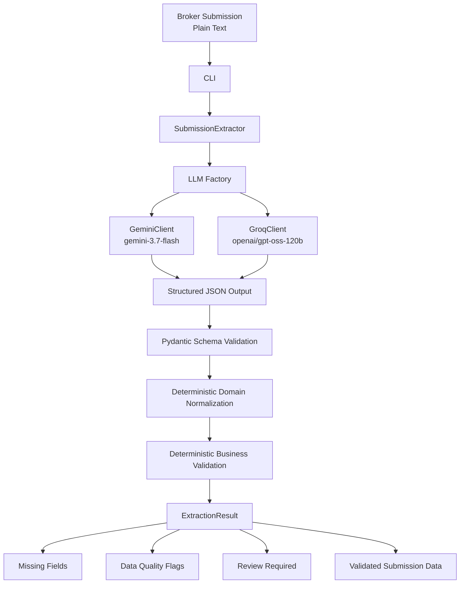
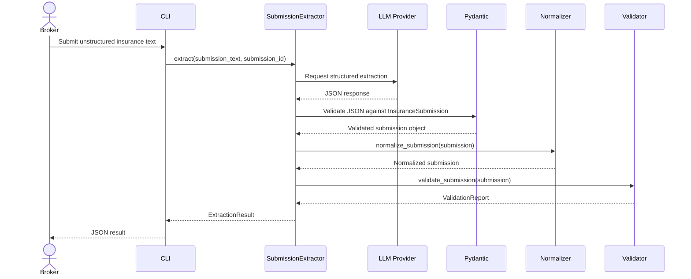
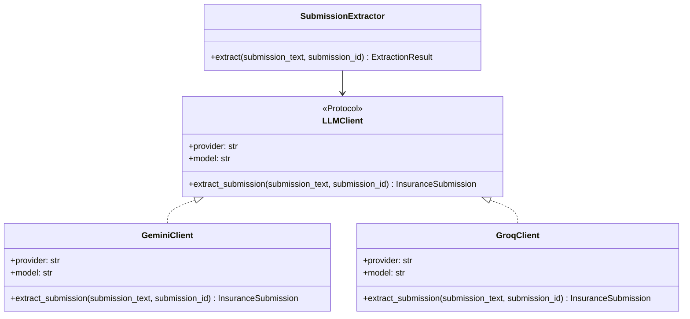
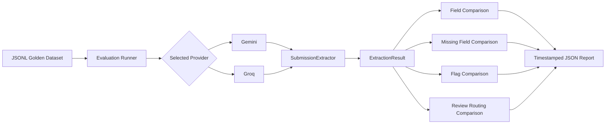
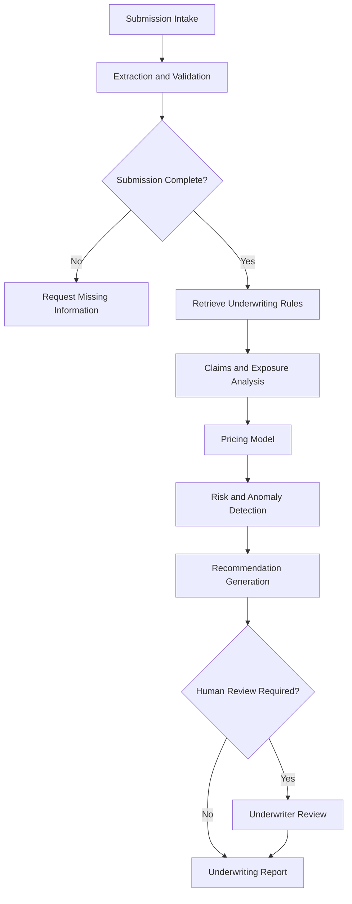

# System Architecture

## Purpose

This document describes the architecture of the Insurance Submission Extractor.

The application transforms unstructured commercial insurance submissions into structured, validated, and auditable data. It is designed as a provider-agnostic extraction component that can later become the ingestion and validation layer of an agentic underwriting platform.

## High-Level Architecture



## Main Components

| Component | Responsibility | Provider-Specific |
|---|---|---:|
| `cli.py` | Accepts a text submission or input file and prints a JSON result | No |
| `config.py` | Loads validated runtime configuration from environment variables | No |
| `llm/base.py` | Defines the common LLM client contract | No |
| `llm/factory.py` | Creates the client selected by `LLM_PROVIDER` | No |
| `llm/gemini_client.py` | Calls Gemini and parses structured output | Yes |
| `llm/groq_client.py` | Calls Groq and parses structured output | Yes |
| `schemas/submission.py` | Defines Pydantic contracts and domain enums | No |
| `services/extractor.py` | Coordinates extraction, normalization, and validation | No |
| `services/normalizers.py` | Applies deterministic domain mappings | No |
| `services/validators.py` | Identifies missing fields and business-rule issues | No |
| `evaluation.py` | Compares results against the golden dataset | No |
| `scripts/run_evaluation.py` | Runs provider-specific benchmark evaluations | No |

## Extraction Sequence



## Validation Layers

The application applies four distinct control layers. Each layer addresses a different risk and must remain separate.

| Layer | Purpose | Example |
|---|---|---|
| LLM structured extraction | Convert unstructured text into a known JSON shape | Extract annual revenue from a broker submission |
| Pydantic validation | Enforce types, enums, numeric constraints, and internal model consistency | Reject a future claim year or an unsupported claim type |
| Deterministic normalization | Apply explicit and versioned domain mappings | Map business activity `Restaurant` to occupancy type `restaurant` |
| Deterministic business validation | Identify missing or inconsistent underwriting information | Flag a building construction year later than a reported claim year |

## Provider Abstraction



The application business layer depends on the `LLMClient` contract, not on a provider SDK. This allows Gemini and Groq to be selected through environment configuration without changing schemas, validation rules, normalization logic, CLI behavior, or evaluation code.

## Evaluation Architecture



The evaluation runner measures provider behavior against a versioned synthetic golden dataset. It evaluates expected fields, acceptable semantic alternatives, expected missing fields, deterministic data-quality flags, and the `review_required` routing signal.

## Security Boundaries

```text
Tracked by Git
- Source code
- Tests
- Synthetic submissions
- Golden dataset
- Documentation
- .env.example
- uv.lock

Never tracked by Git
- .env
- API keys
- Real customer submissions
- Real claims data
- Generated evaluation reports
```

All current examples and datasets are synthetic. The application must not send real policyholder or claims data to external LLM providers without a documented data-governance, privacy, contractual, and security review.

## Future Underwriting Agent

The current component will become the first stage of a larger LangGraph underwriting workflow.



The Insurance Submission Extractor is intentionally limited to intake, normalization, and validation. It does not make underwriting decisions or pricing recommendations.
